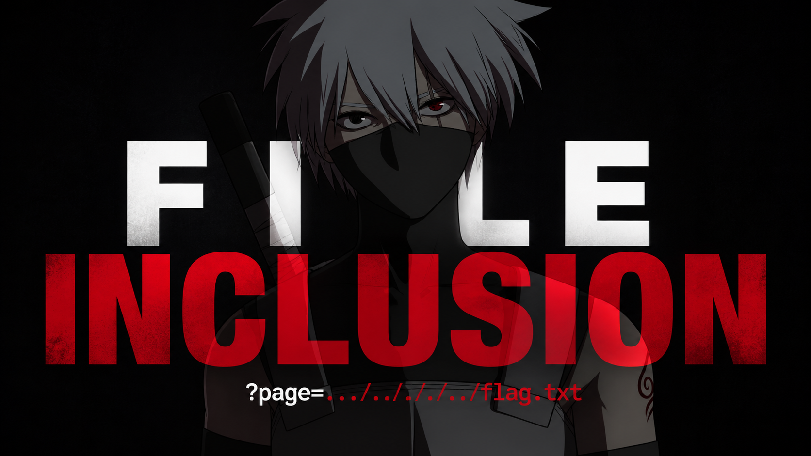

# Fábio Vieira — Cybersecurity Portfolio

Hands-on investigations, SOC labs, threat hunting, and practical cybersecurity projects.

---

## Links

- LinkedIn: https://www.linkedin.com/in/fabiovieiracy
- YouTube: https://www.youtube.com/@hfafas
- Hack The Box: https://profile.hackthebox.com/profile/019e022a-d3c9-712b-b934-8bb56c4e296e
- Email: f.vieira01t01@gmail.com

---

### Certification Badges

---

## Portfolio Sections

| Section | Content |
| :--- | :--- |
| [Detection & Response](detection-response/) | SIEM investigations, alert triage, and log analysis |
| [Network Analysis](network-analysis/) | Wireshark, tcpdump, packet analysis, and traffic investigations |
| [Endpoint & Forensics](endpoint/) | Sysmon, Windows Event Logs, endpoint investigations |
| [Investigations](investigations/) | Threat hunting exercises and walkthroughs |

---

# Projects

| Project | Description |
| :--- | :--- |
| [Home Lab](projects/homelab/) | Personal cybersecurity home lab environment and infrastructure |
| [Personal Projects](projects/personal_projects/) | Python-based Bitcoin testnet wallet creation and transaction handling |

---

# Latest Videos

<table>
<tr>
<td>

</td>

<td>

</td>
</tr>
</table>

---

# Certifications

| Certification | Status |
| :--- | :--- |
| [Google Cybersecurity Certificate](certs/Coursera_2GIISNMF0ERH.pdf/) | Completed |
| [CertiProf – CAPC](certs/generate-pdf.pdf/) | Completed |
| HTB CDSA | In Progress |
