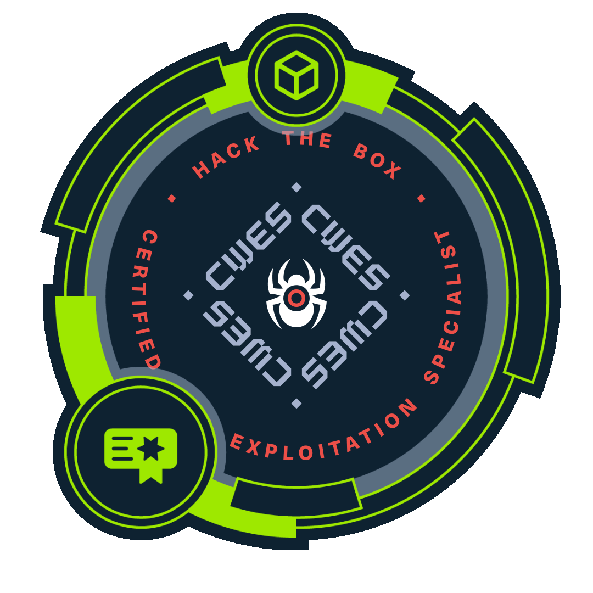
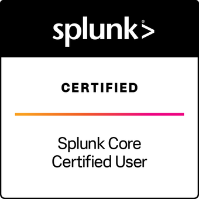

# Fábio Vieira — Cybersecurity Portfolio

CTF, OWASP Top 10 exploitation, and hands-on web app pentesting (HTB Academy, PortSwigger). SOC/blue team background — thinking like both attacker and defender.

---

## Links

- LinkedIn: https://www.linkedin.com/in/fabiovieiracy
- YouTube: https://www.youtube.com/@hfafas
- Hack The Box: https://profile.hackthebox.com/profile/019e022a-d3c9-712b-b934-8bb56c4e296e
- TryHackMe: https://tryhackme.com/p/hfafas
- Email: f.vieira01t01@gmail.com

---

### Certification Badges

---

## Portfolio Sections

| Section | Content |
| :--- | :--- |
| [PENTEST \ WEB-SEC](pentest/) | web-security, Linux, AD |
| [Detection & Response](detection-response/) | SIEM investigations, alert triage, and log analysis |
| [Network Analysis](network-analysis/) | Wireshark, tcpdump, packet analysis, and traffic investigations |
| [Endpoint & Forensics](endpoint/) | Sysmon, Windows Event Logs, endpoint investigations |
| [Investigations](investigations/) | Threat hunting exercises and walkthroughs |

---

# Projects

| Project | Description |
| :--- | :--- |
| [Home Lab](projects/homelab/) | Personal cybersecurity home lab environment and infrastructure |
| [Personal Projects](projects/personal_projects/) | Personal small projects |

---

# Latest Videos

<table>
<tr>
<td>

</td>

<td>

</td>
</tr>
</table>

---

# Certifications

| Certification | Status |
| :--- | :--- |
| [Google Cybersecurity Certificate](certs/Coursera_2GIISNMF0ERH.pdf/) | Completed |
| [CertiProf – CAPC](certs/generate-pdf.pdf/) | Completed |
| [Splunk – Core Certified User](certs/SplunkCoreCertifiedUser_Badge20260521-31-eerbu0.pdf/) | Completed |
| [HTB CWES](certs/CWES.png)| Completed |
